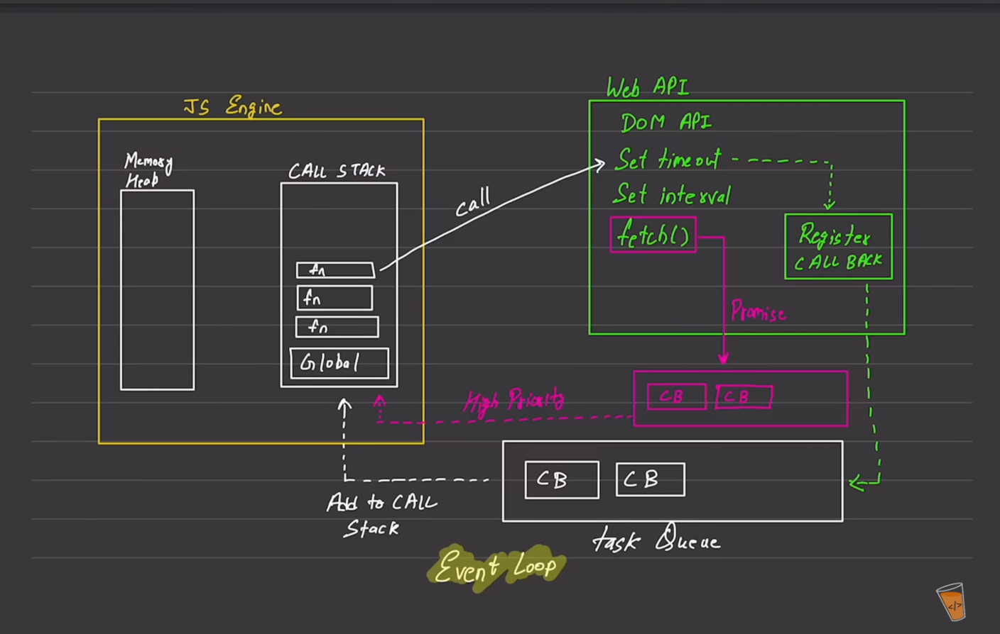

## javascript 
- Synchronous
- Single threaded 

## Execution context 
  - Execute one line of code at a time
  1. console.log -> 1
  2. console.log -> 2
   [Call Stack] [Memory Heap]

`each opertion waits for the lat one to complete before executing`

## Blocking code vs non blocking code

1. Blocking code :- Block the flow the program -> Read file sync
2. Non Blocking code :- Does not block execution -> Read File Async

